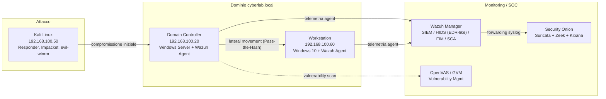

# Virtual SOC Home Lab

> Laboratorio SOC autocostruito per **detection engineering**, **threat hunting** e **incident response** in ottica blue team. Un dominio Active Directory monitorato da uno stack di sicurezza reale, con scenari di attacco simulati, regole di detection custom e report d'incidente in stile SOC.

-1f497d)


---

## Indice

- [Obiettivo](#obiettivo)
- [Architettura del laboratorio](#architettura-del-laboratorio)
- [Stack tecnologico](#stack-tecnologico)
- [Scenari documentati](#scenari-documentati)
- [Detection engineering](#detection-engineering)
- [Metriche chiave](#metriche-chiave)
- [Struttura del repository](#struttura-del-repository)
- [Lezioni apprese e gap di detection](#lezioni-apprese-e-gap-di-detection)
- [Contatti](#contatti)

---

## Obiettivo

Questo repository raccoglie il lavoro svolto su un **home lab SOC completo e funzionante**, costruito per sviluppare competenze pratiche sull'intero ciclo di detection invece che su esercizi isolati: ingestione dei log, scrittura di regole custom, triage degli alert, mappatura MITRE ATT&CK e risposta agli incidenti secondo il modello SANS PICERL.

L'approccio seguito mette al centro due principi:

- **Separare il segnale dal rumore**: il triage si basa sull'esposizione reale, non sul numero grezzo di alert o CVE.
- **Documentare anche ciò che non viene rilevato**: i gap di detection sono il punto di partenza per migliorare le regole, non qualcosa da nascondere.

---

## Architettura del laboratorio

Dominio Active Directory `cyberlab.local` monitorato da uno stack di sicurezza dedicato. Una macchina di attacco genera la telemetria con cui scrivere e validare le regole di detection.



> **Nota su risorse:** durante gli scenari di lateral movement la workstation Windows 10 sostituisce la VM GVM (che non viene avviata), mantenendo il limite di 5 VM simultanee.

---

## Stack tecnologico

| Categoria | Strumenti |
|---|---|
| SIEM / Monitoring | Security Onion, Wazuh (SIEM/HIDS con funzioni EDR-like, FIM/SCA), Kibana |
| Network IDS/IPS | Suricata, Zeek |
| Vulnerability Management | OpenVAS / GVM |
| Detection / Threat | MITRE ATT&CK, Sigma, YARA, Sysmon |
| Active Directory | GPO, Security Baseline (CIS), audit policy |
| Scripting / Automazione | Python (parsing log, automazione analisi), PowerShell, Bash |
| Tooling offensivo (per detection) | Responder, Impacket, evil-winrm, hashcat |

---

## Scenari documentati

Ogni scenario include la descrizione dell'attività, la mappatura MITRE ATT&CK, gli IoC e le regole di detection coinvolte.

### 1. Credential Harvesting: LLMNR/NBT-NS Poisoning
Avvelenamento delle richieste di risoluzione nomi con Responder e cattura di un hash NetNTLMv2 di dominio. Documentato il limite di detection a livello rete nell'ambiente NAT e il relativo controllo compensativo a livello endpoint.
**MITRE:** `T1557.001` · [Write-up »](docs/scenari/01-credential-harvesting.md)

### 2. Incident Response su Malware
Simulazione della ricezione di un file malevolo (EICAR) sul Domain Controller e gestione dell'incidente secondo le cinque fasi del modello **SANS PICERL** (Identification, Containment, Eradication, Recovery, Lessons Learned). Detection multi-livello Wazuh (FIM + Windows Defender).
**MITRE:** `T1204` · [Write-up »](docs/scenari/02-incident-response-malware.md)

### 3. Kill Chain completa: Pass-the-Hash & Lateral Movement
Catena d'attacco completa: poisoning LLMNR → cracking offline → accesso al DC via WinRM → disabilitazione antivirus → dump di NTDS.DIT (DCSync) → lateral movement Pass-the-Hash verso la workstation con privilegi SYSTEM. **Fase di lateral movement rilevata in meno di 5 secondi** dall'alert automatico.
**MITRE:** `T1557.001` · `T1021.006` · `T1562.001` · `T1003.006` · `T1550.002` · `T1021.002` · `T1543.003`
[Write-up »](docs/scenari/03-pass-the-hash.md) · [Report d'incidente INC-2026-0042 »](docs/report-incidenti/INC-2026-0042.pdf)

### 4. Vulnerability Assessment & Hardening
Scan con GVM, triage delle vulnerabilità orientato al rischio reale e applicazione di una Security Baseline via GPO, con misurazione del miglioramento dello score SCA.
[Write-up »](docs/scenari/04-vulnerability-hardening.md)

---

## Detection engineering

Le regole custom scritte e validate nel lab sono versionate in questo repository.

### Wazuh: regole custom (`detection-rules/wazuh/local_rules.xml`)

| Rule ID | Livello | Descrizione | MITRE |
|---|---|---|---|
| `100001` | 12 | LLMNR/NBT-NS poisoning, controllo comportamentale (EID 4648) | `T1557.001` |
| `100002` | 6 | Network logon NTLM (EID 4624, type 3), possibile Pass-the-Hash | `T1550.002` |
| `100003` | 0 | Soppressione falsi positivi da account macchina (`$`) | n/d |
| `100004` | 12 | Burst di logon NTLM, pattern Pass-the-Hash automatizzato | `T1550.002` |

> La regola `100001` (basata su EID 4648) è il controllo comportamentale che copre la fase di **poisoning** (`T1557.001`); le regole `100002`–`100004` (basate su EID 4624 type 3 NTLM con condizioni anti-falsi-positivi) coprono l'**esito a valle** della catena, ovvero il logon di rete NTLM riconducibile a **Pass-the-Hash** (`T1550.002`), e sono la versione più robusta consigliata in produzione. La detection primaria del poisoning iniziale resta comunque a **livello di rete** (Suricata).

### Suricata: regole custom (`detection-rules/suricata/local.rules`)

| SID | Descrizione |
|---|---|
| `9000001` | Rilevamento risposte LLMNR su UDP 5355 da host non autoritativo |
| `9000002` | Rilevamento risposte NBT-NS su UDP 137 da host non autoritativo |

---

## Metriche chiave

| Metrica | Valore |
|---|---|
| MTTD lateral movement (Pass-the-Hash) | **< 5 secondi** |
| Security baseline score (SCA) dopo hardening | **24% → 40%** |
| CVE triagiate fino all'unica esposizione reale | **1.561 → 23 → 1** |
| Regole di detection presenti su Security Onion | **71.411 totali (~53.7k abilitate)** |
| Documenti indicizzati in Kibana | **14.131** |

---

## Struttura del repository

```text
soc-home-lab/
├── README.md
├── docs/
│   ├── architettura.md
│   ├── scenari/
│   │   ├── 01-credential-harvesting.md
│   │   ├── 02-incident-response-malware.md
│   │   ├── 03-pass-the-hash.md
│   │   └── 04-vulnerability-hardening.md
│   └── report-incidenti/
│       └── INC-2026-0042.pdf
├── detection-rules/
│   ├── wazuh/
│   │   ├── local_rules.xml
│   │   └── ossec.conf
│   └── suricata/
│       └── local.rules
├── hardening/
│   └── security-baseline-gpo.md
└── scripts/
    └── python/
        └── parse_alerts.py
```

---

## Lezioni apprese e gap di detection

Una parte del valore del lab sta nell'aver documentato **dove la detection ha fallito** e come si correggerebbe:

- **LLMNR/NBT-NS poisoning** non visibile a livello rete nell'ambiente NAT (assenza di port mirroring): la detection primaria è di rete (Suricata su UDP 5355/137); a compensazione è stata adottata una regola endpoint più robusta.
- **Credential dump via DRSUAPI (DCSync)** non rilevato di default, trattandosi di operazioni legittime di Windows: la correzione prevede l'audit dei Directory Service (EID 4662 con i GUID di replica) e il monitoraggio del traffico DRSUAPI su Zeek.
- **Canale `Microsoft-Windows-Windows Defender/Operational`** non attivo di default: senza, la disabilitazione dell'antivirus sarebbe passata inosservata.

---

## Contatti

**Tiziano Becchetti** | Aspirante SOC Analyst (Blue Team)

[](https://www.linkedin.com/in/tiziano-becchetti/)
[](mailto:tiziano.becchetti@gmail.com)

> In preparazione: **CompTIA Security+**

---

<sub>Tutte le metriche e gli artefatti derivano da un home lab personale e controllato. Nomi host, IP e account appartengono all'ambiente di test e non a sistemi di produzione.</sub>
